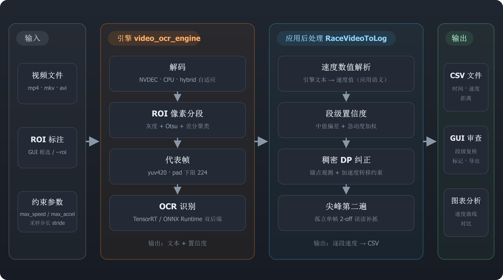

# RaceVideoToLog v2.17.3


从赛车视频中提取速度数据，生成时间-速度-距离 CSV 文件。

## 工作流程



输入视频 + ROI 标注 → 引擎 `video_ocr_engine`（解码 / 分段 / 代表帧 / OCR）
→ 应用后处理（速度解析 / 置信度 / DP 纠正 / 尖峰补抓）→ CSV 与 GUI 产物。

## 引擎依赖（video_ocr_engine）

解码 + OCR 识别链已拆分为独立的通用引擎仓库
[chr431/video_ocr_engine](https://github.com/chr431/video_ocr_engine)
（`FieldExtractor`：解码 → 像素分段 → 代表帧 → OCR 文本+置信度，**零速度语义**，
也可用于字幕提取等通用场景）。本仓库以 **pip 依赖**调用，版本在
`pyproject.toml` 中按 git tag 锁定：

```toml
"video-ocr-engine @ git+https://github.com/chr431/video_ocr_engine.git@v0.11.0"
```

`pip install -e ".[dev]"` 会自动安装。本地开发引擎时，把引擎源码树放在与本
仓库同级目录（`../video_ocr_engine/`），手动改回源码直连（改代码立刻生效）：

```bash
pip install -e ..\video_ocr_engine --no-deps
```

**升级引擎**：改 `pyproject.toml` 里的 tag 后重跑 `pip install -e ".[dev]"`。
这是唯一的接入点 —— 不再有 submodule 指针要手动同步。

> **2026-08-30 起不再使用 git submodule。** 此前 `third_party/video_ocr_engine`
> 是 submodule，存在三个问题：detached HEAD 下可本地提交而不被告警（曾出现
> 本地 commit 未被上游吸收、本地分支落后上游 90 个提交，误 checkout 会把引擎
> 静默回退）；旧安装脚本把绝对路径写进 `.pth`，硬编码盘符、换机器即失效；
> 版本推进全靠手动改指针、无约束。改为 pip 依赖后版本由一行锁定，CI 与全新
> 环境可复现。

引擎使用独立版本线（0.11.x，即 wheel 版本号 —— 引擎 `pyproject.toml` 用
`dynamic` 从 `engine_config.__version__` 读取，避免两处不同步）；应用版本
（2.17.x）仍以 `config.__version__` 为单一事实源，两者解耦。

## 前置要求

- Windows x64 + Python 3.11–3.14
- NVIDIA 显卡 + 最新驱动（GPU 视频解码；无 GPU 自动使用 CPU 软件解码，
  性能差异约 5% —— OCR 全物理核线程预算下两者接近）
- （可选）CUDA Toolkit 13.x + TensorRT 11.x（GPU OCR 推理；无则自动使用 CPU）

## 安装

标准 venv + pip 一条命令（引擎与 decord fork wheel 均由 `pyproject.toml`
直接 URL 锁定，**无任何自定义安装脚本**）：

```bash
python -m venv .venv
.venv\Scripts\python -m pip install -e ".[dev]"
```

`pip install -e .` 自动完成：

1. 安装所有 Python 依赖（PySide6 / onnxruntime / cuda-python / TensorRT 绑定等）
2. 引擎 `video-ocr-engine`（git tag 锁定，见上节）
3. decord 自建 fork wheel（GitHub release 直接 URL，DLL 随包自带，见下节）

### 自建 decord（pip 直依赖）

本项目**不依赖 PyPI decord**（CPU-only、无 `next_roi` / `get_codec`、CPU 解码
内存溢出）。自建 fork（chr431/decord）支持 NVDEC GPU 硬解码 + CPU 软件解码，
只传输识别 ROI（解码提速 ~45%，编码信息直接来自 decord），且 GPU API 运行时
动态加载 —— 无 NVIDIA 设备自动回退 CPU 解码。

**当前版本 0.8.2**（fork 自 0.8.2 起发布 cp39–cp314 全版本 wheel，decord.dll
+ FFmpeg 9 DLL 随包自带；引擎 0.11.0 的 hybrid 解码为 decord 原生实现，
需 fork ≥0.7.15）。版本在 `pyproject.toml` 中按解释器版本以 PEP 508 直接
URL 锁定：

```toml
"decord @ https://github.com/chr431/decord/releases/download/v0.8.2/decord-0.8.2-cp311-cp311-win_amd64.whl ; python_version == '3.11'",
"decord @ https://github.com/chr431/decord/releases/download/v0.8.2/decord-0.8.2-cp312-cp312-win_amd64.whl ; python_version == '3.12'",
"decord @ https://github.com/chr431/decord/releases/download/v0.8.2/decord-0.8.2-cp313-cp313-win_amd64.whl ; python_version == '3.13'",
"decord @ https://github.com/chr431/decord/releases/download/v0.8.2/decord-0.8.2-cp314-cp314-win_amd64.whl ; python_version == '3.14'",
```

**升级 decord**：全部行换成同版本 URL → `pip install -e ".[dev]"`。
没有 PyPI 回退（官方版缺 fork API，误装会在解码路径静默失效）。

> **2026-09-09（v2.17.3）起废弃 `_decord_build\` zip 拷贝流程**：此前 decord
> 需手动下载发布产物 zip、解压后由安装脚本把 DLL 和 Python 层拷进
> site-packages；0.8.2 wheel 把这套流程完全标准化了。

## 使用

### GUI

```bash
.venv\Scripts\python RaceVideoToLog.py
```

### CLI

```bash
.venv\Scripts\python RaceVideoToLog.py video.mp4 --roi X1 Y1 X2 Y2 -o output.csv
```

## 输出格式

```csv
# RaceVideoToLog v2.17.3
# video=test5.mp4, fps=59.767
# roi=843,993,948,1025, format=km/h, frame_start=362, frame_end=7585
# max_speed=400.0, max_accel=50.0, force_aspect=0.0, fill_width=224
# backend=decord/GPU, model=v6_small
# segments=2533, corrected=118
# timing: decode=6.4s, ocr=13.5s, correction=0.9s, total=22.0s
362,0.00,257,21
```

| Flag | 含义 |
|------|------|
| 0    | 原始 OCR 值 |
| 11   | 自动修正（DP 稠密纠正） |
| 12   | 插值填充（OCR 未读出） |
| 21   | 高可信帧（conf 通过锚定阈值） |
| 22   | 用户手动修正 |

## CLI 参数

```text
python RaceVideoToLog.py [video] [options]

位置参数:
  video                          视频文件（省略则启动 GUI）

可选参数:
  --roi X1 Y1 X2 Y2              识别范围（CLI 必需）
  --format {m/s,km/h,mile/h}     速度单位 (默认: km/h)
  --max-speed N                  最大速度 km/h (默认: 400)
  --max-accel N                  最大加速度 m/s² (默认: 50)
  --force-aspect N               强制宽高比 (默认: 0=不启用；>0 宽度=48×此值)
  --fill-width N                 预处理 pad 宽度下限 px (默认: 224；速度窄图更准)
  --buffer N                     解码∥OCR 流水线队列缓冲，段数 (默认: 128)
  --decode-backend {auto,cpu,nvdec,hybrid}  解码后端 (默认: auto 自动选 GPU；hybrid=CPU+NVDEC 混合解码，NVDEC 与 CPU 软解按关键帧分片竞争，AV1 自动回退纯 NVDEC)
  --ocr-backend {auto,cpu,tensorrt}  OCR 推理后端 (默认: auto 自动选 GPU)
  --log-level {normal,detailed,debug} 日志级别 (默认: normal)
  --frame-start N                起始帧号
  --frame-end N                  结束帧号
  --no-monitor                   禁用资源监控（内存/CPU/GPU 采样）
  --monitor-interval SEC         资源采样间隔秒 (默认: 1.0)
  --from-csv PATH                从 CSV 文件头导入设置（显式参数优先）
  -o, --output PATH              输出 CSV 路径
```

## 测试与回归门禁

### 单元/集成测试（CI 每推必跑）

```bash
.venv\Scripts\python -m pytest tests/ -v
```

覆盖：分段/纠错链（`test_segment_flow` / `test_correction_chain`）、CSV 解析
与 from-csv 显式参数优先（`test_csv_io` / `test_from_csv`）、打包清单完整性
（`test_packaging`）、以及无视频即可复跑的回归夹具（见下）。`test_decoder_integration`
在缺 decord 时显式跳过——CI 的 decoder-smoke job 会从 chr431/decord release
下载 fork 并真实运行它。

### 准确率漏斗（最终门禁，本机跑）

```bash
.venv\Scripts\python tools/accuracy_breakdown.py        # 跑 5 个测试视频并对比基线
.venv\Scripts\python tools/accuracy_breakdown.py --update-baseline   # 有意改动后更新基线
```

跑 test/test2/test3/test5/test6（测试视频在 `D:\Videos\racelog_test`，truth 在
`ground_truth_csv/`）并与 `tools/baseline.json` 对比：任一视频或总量的最终错误数
增加即退出码 1（回归）。当前基线 **0 错误**（全部视频 0，TOL±1）。

### CI 回归夹具（tests/fixtures/，无视频可跑）

- `seg_series/*.json` + `tests/test_seg_series.py`：生产 run() 的全量段级序列，
  CI 重构置信度+稠密 DP 纠错并逐段断言与基线一致。
- `ocr_frames/` + `tests/test_ocr_fixtures.py`：错误案例代表帧的原始 ROI
  裁剪（当前 0 案例），onnxruntime CPU 锁定 OCR 行为基线。
- `videos/smoke_speedo.mp4`：解码集成测试的迷你视频（127KB，仓库内唯一入库视频）。

夹具由 `tools/make_regression_fixtures.py` 生成（需本机 decord + 测试视频）。
任何算法/预处理/模型改动使夹具读数变化 → CI 失败；属有意改动时先跑完整漏斗
确认无回归，再重新生成夹具并更新基线。

## 线程预算（自动）

OCR 推理线程数默认 = **全部物理核**：NVDEC 解码时 CPU 全部让给 OCR；CPU
解码时 FFmpeg 帧线程 + filter 走 decord fork 默认（占 SMT 份额，不抢物理核）。
16C32T 实测（test5 7223 帧）：GPU 解码+CPU OCR 8.9s / CPU 解码+CPU OCR 9.3s
（旧 8 线程预算分别为 11.3s / 12.8s）。超过物理核（超线程）不再提升，
故自动封顶。`RVTOL_OCR_THREADS` 环境变量可覆盖（实验用）。

## 打包（frozen exe）

```bash
.venv\Scripts\python -m pip install -e ".[dev,build]"
.venv\Scripts\python -m PyInstaller RaceVideoToLog.spec --noconfirm
```

生成 `dist/RaceVideoToLog/`。GPU 用户仅需 NVIDIA 驱动（NVDEC 解码）；TensorRT OCR 推理需额外安装 CUDA Toolkit + TensorRT 并加入 PATH。

## 变更记录

完整发布日志（v2.7.1 → v2.17.3）见 [release_notes.md](release_notes.md)。

## 运行时缓存（卸载时需删除）

程序会在用户目录创建以下缓存（卸载/清理时需手动删除）：

| 路径 | 内容 |
| --- | --- |
| 源码运行：`third_party/video_ocr_engine/ocr_engines\`（引擎子模块目录，引擎仓库 .gitignore 已忽略）；打包后：EXE 同目录 `ocr_engines\` | TensorRT 引擎缓存：首次运行时由 ONNX 模型自动构建（约 2 分钟），之后直接复用。**与 GPU 架构绑定**（如 sm89 = RTX 40 系）—— 换显卡后旧引擎会自动失效并回退/重建。删除后下次运行会重新构建。 |
| 源码运行：`third_party/video_ocr_engine/logs\`；打包后：EXE 同目录 `logs\` | 运行日志。 |

> 旧版（≤v2.13）`%LOCALAPPDATA%\RaceVideoToLog\ocr_engines\` 的引擎缓存会被
> `ocr_trt.py` 只读回退复用（不写入），换目录后无需主动迁移。

## License

本应用 **GPLv3**（因依赖 PySide6-Fluent-Widgets GPLv3）。详见 LICENSE 文件。

> 引擎子模块 [chr431/video_ocr_engine](https://github.com/chr431/video_ocr_engine)
> 是独立通用库，**放宽为 Apache-2.0**（无 GUI 依赖限制），可以从子模块独立分发/复用。
